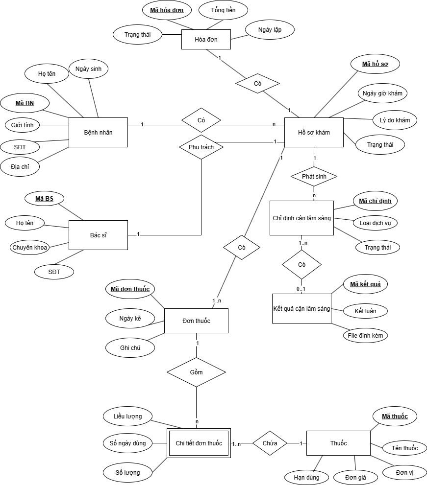

# 🏥 Hospital Management System – System Analysis

## Authors:
- **Bùi Mai Khanh**
- **Lê Phúc Bảo Ngọc**

---

## Introduction
In many hospitals, the process of patient admission and management is still manual, leading to:

- Long waiting times  
- Errors in data storage  
- Difficulty in controlling costs and medicines  

The system analyzed in this project aims to:

- **Digitalize the medical examination and treatment process**  
- **Integrate web/app platforms** for patient self-registration  
- **Automate management** of medical records, prescriptions, and hospital fees  
- Ensure **transparency and accuracy** in healthcare operations  

---

## Contents

### Part 1. Requirement Definition
- Organizational structure model  
- User needs & software requirements  
- Forms (registration, medical examination sheet, invoice…)  
- Hospital regulations  
- Responsibility matrix  
- Detailed business process descriptions  

### Part 2. System Analysis
- Function decomposition diagram (BPC)  
- Data Flow Diagrams (DFD: Context & Level 0)  
- Entity-Relationship Diagram (ERD)  
- Use Case Diagram  
- BPMN (AS-IS, TO-BE)  
- UI mockups (App/Web for patients, Internal system for staff)  

---

## Illustrations

### ERD

### Use Case

### DFD – Context

### DFD – Level 0

### Function Decomposition (BPC)

### BPMN – AS-IS

### BPMN – TO-BE

---

## Suggested Implementation
If implemented as a real hospital management system, the following technology stack can be used:

- **Frontend**: ReactJS / Vue / Angular  
- **Backend**: Node.js / Java Spring Boot / .NET Core  
- **Database**: MySQL / PostgreSQL  
- **Deployment**: Docker + CI/CD with GitHub Actions  
- **Authentication**: OAuth2 / JWT  
- **Payment Integration**: VNPay, Momo, PayPal  

---

## Key Objectives
- Standardize & digitalize hospital workflows  
- Support patients with **online booking**  
- Reduce workload for receptionists, cashiers, and nurses  
- Ensure **transparency and accuracy** in fee & prescription management  

---
