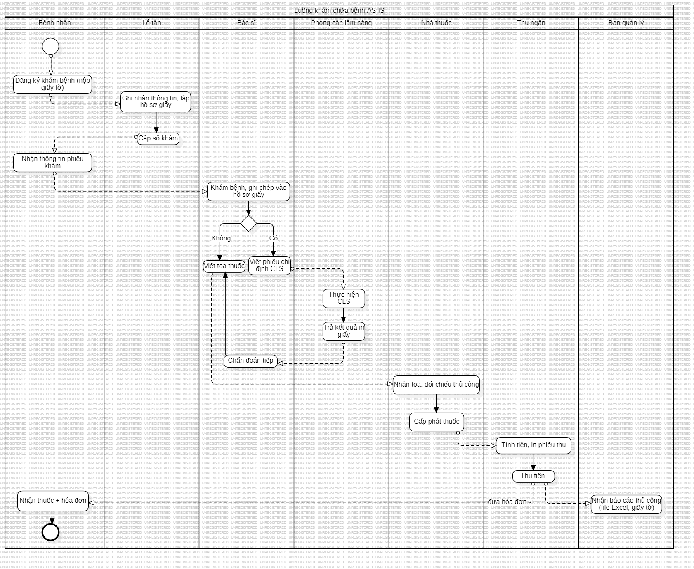

# 🏥 Hospital Management System – System Analysis

## Authors:
- **Bùi Mai Khanh**
- **Lê Phúc Bảo Ngọc**

## Giới thiệu
Trong nhiều bệnh viện, quy trình tiếp nhận và quản lý bệnh nhân vẫn còn thủ công, gây:
- Thời gian chờ lâu
- Sai sót trong lưu trữ thông tin
- Khó kiểm soát chi phí & thuốc men

Hệ thống được phân tích trong tài liệu này hướng tới:
- **Số hóa quy trình** khám chữa bệnh
- **Tích hợp web/app** để bệnh nhân tự đăng ký
- **Quản lý tự động** hồ sơ, thuốc, viện phí
- **Minh bạch & chính xác** trong nghiệp vụ y tế

---

## 📂 Nội dung tài liệu

### Phần 1. Xác định yêu cầu
- Mô hình cơ cấu tổ chức
- Nhu cầu người dùng & yêu cầu phần mềm
- Biểu mẫu (đăng ký khám, phiếu khám, hóa đơn…)
- Quy định bệnh viện
- Bảng trách nhiệm
- Mô tả chi tiết yêu cầu nghiệp vụ

### Phần 2. Phân tích hệ thống
- Biểu đồ phân cấp chức năng (BPC)
- Sơ đồ luồng dữ liệu (DFD: Context & Level 0)
- Mô hình thực thể – mối kết hợp (ERD)
- Use Case Diagram
- BPMN (AS-IS, TO-BE)
- Thiết kế giao diện (app/web cho bệnh nhân, nội bộ cho nhân viên)

---
## Hình minh họa
### ERD

### Use Case

### DFD – Mô hình ngữ cảnh

### DFD – Mức 0

### Biểu đồ phân cấp chức năng (BPC)

### BPMN – AS-IS

### BPMN – TO-BE

---

## 🛠️ Công nghệ gợi ý triển khai (nếu dùng thực tế)
Nếu triển khai thành hệ thống thực tế, có thể dùng:
- **Frontend**: ReactJS / Vue / Angular
- **Backend**: Node.js / Java Spring Boot / .NET Core
- **Database**: MySQL / PostgreSQL
- **Triển khai**: Docker + CI/CD trên GitHub Actions
- **Authentication**: OAuth2 / JWT
- **Thanh toán**: Tích hợp cổng thanh toán (VNPay, Momo…)

---

## Mục tiêu chính
- Chuẩn hóa & số hóa quy trình **khám chữa bệnh**.
- Hỗ trợ bệnh nhân **đặt lịch online** nhanh chóng.
- Giảm tải cho nhân viên tiếp nhận, thu ngân, y tá.
- Đảm bảo **minh bạch, chính xác** trong quản lý viện phí & thuốc.

---
